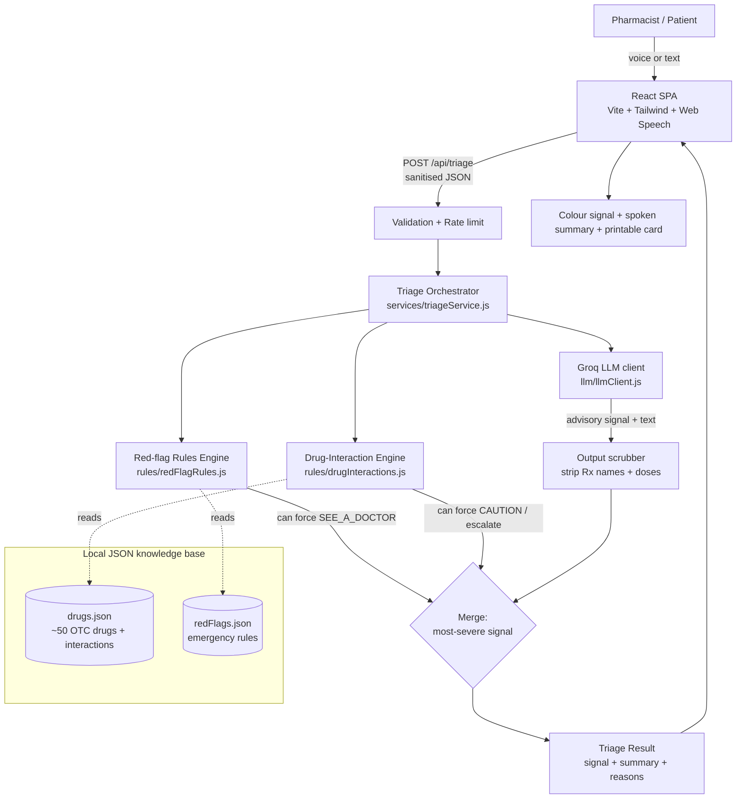

# Architecture — Sahayak

## 1. System overview

Sahayak is a two-tier app (React SPA + Express API) with a strict separation
between **deterministic safety rails** and the **advisory LLM**. The defining
architectural decision is that *rules always override the model*.



## 2. Request data flow

1. **Capture** — The SPA collects symptoms (voice→text or typed), optional age,
   current medicines, allergies, and a consent flag. Voice uses the Web Speech
   API; if unsupported, the typed path is identical.
2. **Transport** — `POST /api/triage` with a small JSON body over the Vite dev
   proxy (same-origin; no hardcoded host).
3. **Guard** — `validateTriageInput` sanitises every field (strip control chars
   and `<>`, collapse whitespace, cap lengths) and rejects empty input.
   `triageRateLimiter` caps requests per IP.
4. **Orchestrate** — `runTriage` executes the pipeline below.
5. **Respond** — A single JSON object: `signal`, `summary`,
   `followUpQuestions`, `otcGuidance`, `safetyReasons`, `emergencyAdvice`,
   `meta`. The SPA renders it (XSS-safe React text), speaks the headline, and
   offers a printable summary.

## 3. The triage pipeline (orchestrator)

```
runTriage(input):
  signal = SAFE
  redFlags  = checkRedFlags(symptoms)          # deterministic
  drugCheck = checkInteractions(meds, allergy) # deterministic
  signal = escalate(signal, redFlags.signal)
  signal = escalate(signal, drugCheck.signal)

  if LLM configured:
     llm = requestTriage(prompt, untrusted_data)   # advisory
     llm = scrubProhibitedContent(llm)             # strip Rx names/doses
     signal = escalate(signal, llm.signal)
  else:
     use deterministic fallback summary

  return compose(signal, redFlags, drugCheck, llm)
```

`escalate(a, b)` returns the more severe of two signals using a fixed severity
rank (`SAFE < CAUTION < SEE_A_DOCTOR`). Because the rails are applied with
`escalate`, **the LLM can only ever raise the signal's floor set by the rules —
never lower it.** `normalizeSignal` maps any unexpected model output to
`CAUTION` (fail-safe, never to `SAFE`).

## 4. Safety-rails design (the core innovation)

| Rail | Where | Trigger | Effect |
| ---- | ----- | ------- | ------ |
| **Red-flag engine** | `rules/redFlagRules.js` + `data/redFlags.json` | Keyword match (EN + Hindi, Roman + Devanagari) for emergencies | Forces `SEE_A_DOCTOR`, attaches emergency advice |
| **Drug-interaction engine** | `rules/drugInteractions.js` + `data/drugs.json` | Pairwise class/allergy-group rules; duplicate-dose detection; Rx-only detection | Forces `CAUTION` (moderate) or `SEE_A_DOCTOR` (high/allergy/Rx) |
| **Output scrubber** | `services/triageService.js` | Regex for dosage patterns + known Rx drug names | Redacts prohibited content from model text |
| **Signal normaliser** | `rules/signals.js` | Unknown/garbled model signal | Defaults to `CAUTION` |

Design principles:
- **Deterministic and explainable.** Keyword/rule matching, not a black box — a
  pharmacist *and* an auditor can read exactly why a case escalated. Every
  escalation surfaces as a `safetyReasons` entry in the UI.
- **Defence in depth.** The same rule (no prescriptions) is enforced in the
  system prompt, re-enforced by the code scrubber, and the dataset marks
  Rx-only drugs to deter self-medication.
- **Fail safe, fail open.** If the LLM errors, times out, rate-limits, or is
  unconfigured, the deterministic engines still produce a valid, safe result.

## 5. Why each technology

| Choice | Rationale |
| ------ | --------- |
| **React + Vite + Tailwind** | Fast iteration, tiny bundle, responsive counter-friendly UI; Tailwind gives a consistent signal colour system (`safe`/`caution`/`danger`). |
| **Web Speech API** | Zero-install, in-browser STT/TTS — critical for a voice-first, low-literacy counter use case. Graceful typed fallback keeps it universal. |
| **Node + Express (ESM)** | Minimal, well-understood, easy for graders to read; single orchestration endpoint keeps the surface small. |
| **Groq (OpenAI-compatible)** | Very low-latency inference — important when a pharmacist is waiting at a busy counter. OpenAI-compatible API means the `openai` SDK works unchanged and the provider is swappable. |
| **Local JSON datasets** | No DB to provision for a demo; data is versioned, diffable, and trivially auditable. Clear seam to swap in a real drug DB later. |
| **Vitest** | Fast, zero-config tests focused on the safety-critical engines — the parts that *must* be correct. |

## 6. Extensibility seams

- **More languages:** add a key to `client/src/lib/strings.js` and keyword sets
  to `redFlags.json`; the backend already routes language to the prompt.
- **Real drug DB:** replace `data/drugs.json` and the resolver in
  `drugInteractions.js`; the orchestrator contract is unchanged.
- **Pharmacist dashboard / audit log:** the orchestrator already emits
  structured `meta` (model used, which rails fired) — ready to persist behind a
  consent flag.
- **Swap LLM provider:** change `baseURL`/model env vars; no code change.
